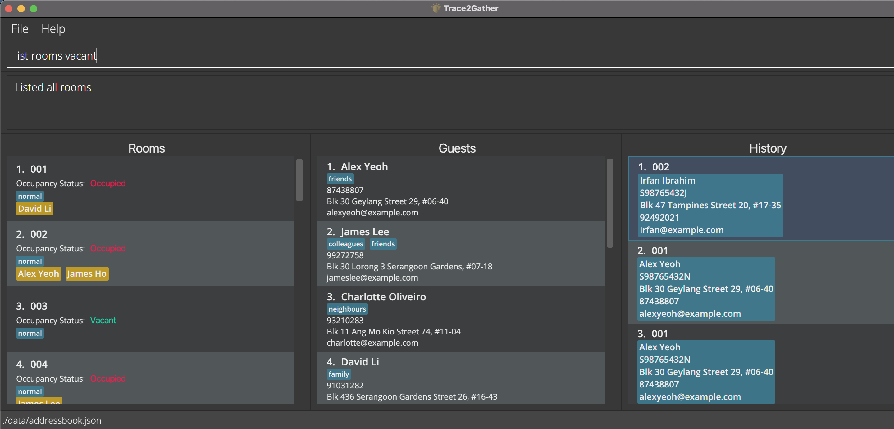
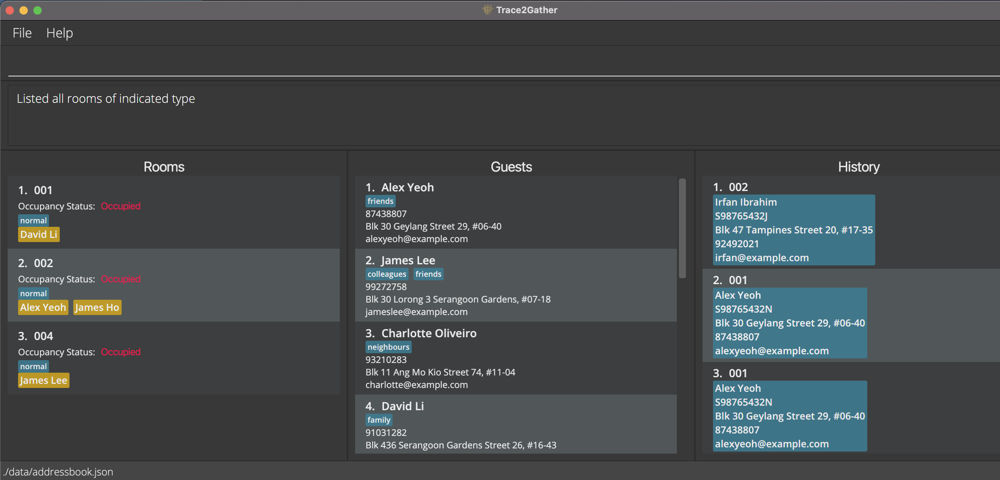
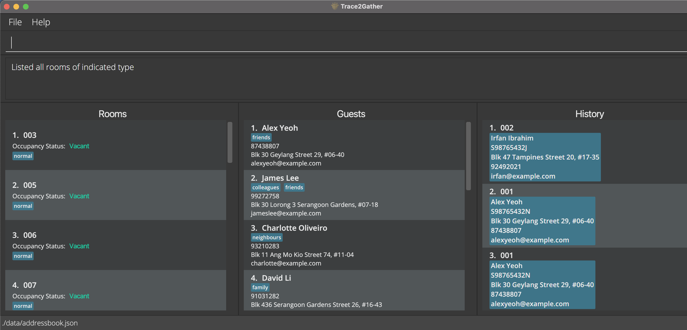
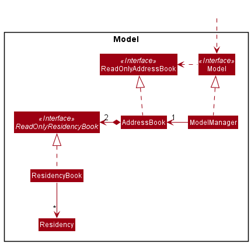

* Table of Contents
{:toc}

--------------------------------------------------------------------------------------------------------------------

## **Acknowledgements**

* {list here sources of all reused/adapted ideas, code, documentation, and third-party libraries -- include links to the original source as well}

--------------------------------------------------------------------------------------------------------------------
## **Introduction**
* Welcome to the developer's guide for Trace2Gather! This guide is meant for developers who may want to contribute to our code base, or use our codebase to build their own project.

--------------------------------------------------------------------------------------------------------------------
## **Setting up, getting started**

Refer to the guide [_Setting up and getting started_](SettingUp.md).

--------------------------------------------------------------------------------------------------------------------

## **Design**

:bulb: **Tip:** The `.puml` files used to create diagrams in this document can be found in the [diagrams](https://github.com/se-edu/addressbook-level3/tree/master/docs/diagrams/) folder. Refer to the [_PlantUML Tutorial_ at se-edu/guides](https://se-education.org/guides/tutorials/plantUml.html) to learn how to create and edit diagrams.

### Architecture

The ***Architecture Diagram*** given above explains the high-level design of the App.

Given below is a quick overview of main components and how they interact with each other.

**Main components of the architecture**

**`Main`** has two classes called [`Main`](https://github.com/se-edu/addressbook-level3/tree/master/src/main/java/seedu/address/Main.java) and [`MainApp`](https://github.com/se-edu/addressbook-level3/tree/master/src/main/java/seedu/address/MainApp.java). It is responsible for,
* At app launch: Initializes the components in the correct sequence, and connects them up with each other.
* At shut down: Shuts down the components and invokes cleanup methods where necessary.

[**`Commons`**](#common-classes) represents a collection of classes used by multiple other components.

The rest of the App consists of four components.

* [**`UI`**](#ui-component): The UI of the App.
* [**`Logic`**](#logic-component): The command executor.
* [**`Model`**](#model-component): Holds the data of the App in memory.
* [**`Storage`**](#storage-component): Reads data from, and writes data to, the hard disk.

**How the architecture components interact with each other**

The *Sequence Diagram* below shows how the components interact with each other for the scenario where the user issues the command `guest Alex`.

Each of the four main components (also shown in the diagram above),

* defines its *API* in an `interface` with the same name as the Component.
* implements its functionality using a concrete `{Component Name}Manager` class (which follows the corresponding API `interface` mentioned in the previous point.

For example, the `Logic` component defines its API in the `Logic.java` interface and implements its functionality using the `LogicManager.java` class which follows the `Logic` interface. Other components interact with a given component through its interface rather than the concrete class (reason: to prevent outside component's being coupled to the implementation of a component), as illustrated in the (partial) class diagram below.

The sections below give more details of each component.

### UI component

The **API** of this component is specified in [`Ui.java`](https://github.com/se-edu/addressbook-level3/tree/master/src/main/java/seedu/address/ui/Ui.java)

The UI consists of a `MainWindow` that is made up of parts e.g.`CommandBox`, `ResultDisplay`, `PersonListPanel`, `StatusBarFooter` etc. All these, including the `MainWindow`, inherit from the abstract `UiPart` class which captures the commonalities between classes that represent parts of the visible GUI.

The `UI` component uses the JavaFx UI framework. The layout of these UI parts are defined in matching `.fxml` files that are in the `src/main/resources/view` folder. For example, the layout of the [`MainWindow`](https://github.com/se-edu/addressbook-level3/tree/master/src/main/java/seedu/address/ui/MainWindow.java) is specified in [`MainWindow.fxml`](https://github.com/se-edu/addressbook-level3/tree/master/src/main/resources/view/MainWindow.fxml)

The `UI` component,

* executes user commands using the `Logic` component.
* listens for changes to `Model` data so that the UI can be updated with the modified data.
* keeps a reference to the `Logic` component, because the `UI` relies on the `Logic` to execute commands.
* depends on some classes in the `Model` component, as it displays `Person` object residing in the `Model`.

### Logic component

**API** : [`Logic.java`](https://github.com/se-edu/addressbook-level3/tree/master/src/main/java/seedu/address/logic/Logic.java)

Here's a (partial) class diagram of the `Logic` component:

How the `Logic` component works:
1. When `Logic` is called upon to execute a command, it uses the `AddressBookParser` class to parse the user command.
1. This results in a `Command` object (more precisely, an object of one of its subclasses e.g., `AddCommand`) which is executed by the `LogicManager`.
1. The command can communicate with the `Model` when it is executed (e.g. to add a person).
1. The result of the command execution is encapsulated as a `CommandResult` object which is returned back from `Logic`.

The Sequence Diagram below illustrates the interactions within the `Logic` component for the `execute("guest Alex")` API call.

:information_source: **Note:** The lifeline for `DeleteCommandParser` should end at the destroy marker (X) but due to a limitation of PlantUML, the lifeline reaches the end of diagram.

Here are the other classes in `Logic` (omitted from the class diagram above) that are used for parsing a user command:

How the parsing works:
* When called upon to parse a user command, the `AddressBookParser` class creates an `XYZCommandParser` (`XYZ` is a placeholder for the specific command name e.g., `AddCommandParser`) which uses the other classes shown above to parse the user command and create a `XYZCommand` object (e.g., `AddCommand`) which the `AddressBookParser` returns back as a `Command` object.
* All `XYZCommandParser` classes (e.g., `AddCommandParser`, `DeleteCommandParser`, ...) inherit from the `Parser` interface so that they can be treated similarly where possible e.g, during testing.

### Model component
**API** : [`Model.java`](https://github.com/se-edu/addressbook-level3/tree/master/src/main/java/seedu/address/model/Model.java)

The `Model` component,

* stores the address book data.
    * All `Person` objects are contained in a `UniquePersonList` object.
    * All `Room` objects are contained in a `RoomList` object.
    * All `Residency` objects are contained in a `ResidencyBook` object.
* stores the currently 'selected' object(s) (e.g., results of a search query) as a separate _filtered_ list which is exposed to outsiders as an unmodifiable `ObservableList` that can be 'observed' e.g. the UI can be bound to this list so that the UI automatically updates when the data in the list change.
    * `Person` objects are stored in `ObservableList<Person>`
    * `Room` objects are stored in `ObservableList<Room>`
    * `Residency` objects are stored in `ObservableList<Residency>`
* stores a `UserPref` object that represents the user’s preferences. This is exposed to the outside as a `ReadOnlyUserPref` objects.
* does not depend on any of the other three components (as the `Model` represents data entities of the domain, they should make sense on their own without depending on other components)

### Storage component

**API** : [`Storage.java`](https://github.com/se-edu/addressbook-level3/tree/master/src/main/java/seedu/address/storage/Storage.java)

The `Storage` component,
* can save both address book data and user preference data in json format, and read them back into corresponding objects.
* inherits from both `AddressBookStorage` and `UserPrefStorage`, which means it can be treated as either one (if only the functionality of only one is needed).
* depends on some classes in the `Model` component (because the `Storage` component's job is to save/retrieve objects that belong to the `Model`)

### Common classes

Classes used by multiple components are in the `seedu.addressbook.commons` package.

--------------------------------------------------------------------------------------------------------------------

## **Implementation**

This section describes some noteworthy details on how certain features are implemented.

### Guest and Room search feature

#### Implementation

The search mechanism is facilitated by `LogicManager`. It extends `Logic` and its invocation is via the `AddressBookParser`.

* `AddressBookParser#parseCommand()` — Interprets the command the user inputs to invoke the `FindGuestCommand` and `FindRoomCommand`.
* `FindGuestCommand#execute()` — Finds the guest in the hotel with matching name
* `FindRoomCommand#execute()` — Finds the room in the hotel with matching room number

These operations are exposed in the `Model` interface as `Model#commitAddressBook()`, `Model#undoAddressBook()` and `Model#redoAddressBook()` respectively.

Given below is an example usage scenario:

1. User searches for the data entry desired. In this case, the user's input is "guest Alex"

2. Hit Enter.

3. The Rooms / Guests that have matching names will appear in their respective lists.

The behaviour of the search mechanism is illustrated by the following sequence diagram.

#### Design considerations:

**Aspect: How search guest / room executes:**

* The string name / room number will be passed into a predicate checker to check if any of the data present contains the information as requested.
    * Pros: Consistent implementation - similar to the other commands.
    * Cons: Increased need for good file system and extensive application of Object-Oriented Principles required.

    
### Listing rooms by vacancy feature

#### Implementation

The list mechanism is facilitated by `LogicManager`. It extends `Logic` and its invocation is via the `AddressBookParser`.

* `AddressBookParser#parseCommand()` — Interprets the command the user inputs to invoke the `ListCommand`.
* `ListCommand#execute()` — Filters the list of rooms based on whether they are vacant or occupied and shows the relevant type to user.

This operation is exposed in the `Model` interface as `Model#updateFilteredRoomList()`.

Given below is an example usage scenario and how the list mechanism behaves at each step.

Step 1. User lists the rooms based on the desired vacancy status.

Step 2. Hit Enter.

The rooms of the specified vacancy status will appear in the room list.

#### Design considerations:

**Aspect: How list room occupied / vacant executes:**

* The valid string will create a predicate object for `Model#updateFilteredRoomList()` to filter the rooms based on.
    * Pros: Consistency - similar implementation as command to list all rooms and list all guests.
    * Cons: Current implementation does not best adhere to OOP principles like inheritance. No new classes such as `ListVacantRoomCommand` and `ListOccupiedRoomCommand`.

### Uniqueness of Guests

#### Implementation

The mechanism guaranteeing the uniqueness of Guests is facilitated by the `Nric` class, and its invocation is via `AddressBookParser`.
* `AddressBookParser#parseCommand()`  — Interprets the command the user inputs to invoke the `AddCommandParser`.
* `ParserUtil#parseNric()`  — checks whether a `Person` object already exists with the same Nric.

#### Design considerations:

**Aspect: How duplicates are avoided:**

* An `AddCommand` that wants to add a `Person` with an `Nric` that another existing `Person` already will be considered an invalid command.
    * Uniqueness  —  This mechanism will help to prevent the adding of duplicate `Person` objects.
    
### Past Records Feature

This section describes how past residencies are stored such that it can be displayed/searched for contact tracing.

The past residencies are read from the same json data file as the other components in the `AddressBook`, through the `JsonAdaptedResidencyBook` class.

They are stored in a `ResidencyBook`, similar to the one storing current residencies.

This `ResidencyBook` only calls upon `ResidencyBook#register(Residency)` but not `ResidencyBook#remove(Residency)` to prevent editing
of the records stored.

It is exposed in `ModelManager#getFilteredRecordList()`, `ModelManager#updateFilteredRecordList()`, `
LogicManager#getFilteredRecordList()` where the contents are stored in a `FilteredList` for display in the UI.

#### Design considerations:

* Possible location of storage of past residencies.
    * Second file.
    * Pros: Keeping past residency storage separate from the main data storage minimises any mixup in the storing of information.
    * Cons: This requires the file to store its own set of persons and rooms and because the residency keeps minimal information in order to minimise
      space required for the storage file, it results in redundancy when storing the same information across 2 files. Changes also have to be written twice.

* Consistency
    * The `ResidencyBook` of past records in `AddressBook` mirrors the storage of guests, rooms and current residencies. A `FilteredList`
      in `ModelManager` to represent the records also helps maintain the consistency and readability of the code.

--------------------------------------------------------------------------------------------------------------------

## **Documentation, logging, testing, configuration, dev-ops**

* [Documentation guide](Documentation.md)
* [Testing guide](Testing.md)
* [Logging guide](Logging.md)
* [Configuration guide](Configuration.md)
* [DevOps guide](DevOps.md)

--------------------------------------------------------------------------------------------------------------------

## **Appendix: Requirements**

### Product scope

**Target user profile**:

* hotel receptionist
* has a need to manage a significant number of guests and rooms
* prefers desktop apps over other types
* can type fast
* prefers typing to mouse interactions
* is reasonably comfortable using CLI apps

**Value proposition**: manage both guests and rooms faster than a typical mouse/GUI driven app

### User stories

Priorities: High (must have) - `* * *`, Medium (nice to have) - `* *`, Low (unlikely to have) - `*`

| Priority | As a …​                                    | I want to …​                     | So that I can…​                                                        |
| -------- | ------------------------------------------ | ------------------------------ | ---------------------------------------------------------------------- |
| `* * *`  | new user                                   | see usage instructions         | refer to instructions when I forget how to use the App                 |
| `* * *`  | user                                       | add a guest as a contact       | check them into rooms                                                  |
| `* * *`  | user                                       | check guests into rooms        | admit them into our hotel                                              |
| `* * *`  | user                                       | check guests out of rooms      | free up the room and have their information in the archive                                                  |
| `* * *`  | user                                       | search for vacant rooms        | assign guests to a vacant room                                         |
| `* * *`  | user                                       | delete guests                  | remove them if the wrong details are entered                           |
| `* * *`  | user                                       | list all guests and rooms      | check all the statuses                                                 |
| `*`      | user with many guests in the address book  | sort guests  by name           | locate a guest easily                                                  |
| `* *`    | user                                       | search guests by their name    | find a guest's details easily                                          |
| `* * *`  | user who has to track past records of guests | perform queries on past data | check records of past guests and details of their stay                 |
| `* *`    | user                                       | add rooms with specified tags  | keep track of different types of rooms in my hotel                     |

*{More to be added}*

### Use Cases

Refer to [_Use Cases_](UseCases.md).

### Non-Functional Requirements

1. Should work on any _mainstream OS_ as long as it has Java `11` or above installed.
2. A user with above average typing speed for regular English text (i.e. not code, not system admin commands) should be able to accomplish most of the tasks faster using commands than using the mouse.
3. Should work without being connected to the Internet.
4. Should be able to use most basic commands within a day of usage.
5. User should be able to identify key information on the GUI quickly using colour coded text.
6. The system should respond within two seconds of a command input.
7. The product is not required to handle the printing of reports.
8. The rooms show what type of rooms they are, such as First Class or Standard etc.
9. Guests have tags assigned to them to better identify them.
10. The data integrity of the application is preserved in the event where the application closes unexpectedly.

### Glossary

* **Mainstream OS**: Windows, Linux, Unix, OS-X
* **Private contact detail**: A contact detail that is not meant to be shared with others

--------------------------------------------------------------------------------------------------------------------

## **Appendix: Instructions for manual testing**

Given below are instructions to test the app manually.

:information_source: **Note:** These instructions only provide a starting point for testers to work on;
testers are expected to do more *exploratory* testing.

### Launch and shutdown

1. Initial launch

   1. Download the jar file and copy into an empty folder

   1. Double-click the jar file Expected: Shows the GUI with a set of sample contacts. The window size may not be optimum.

1. Saving window preferences

   1. Resize the window to an optimum size. Move the window to a different location. Close the window.

   1. Re-launch the app by double-clicking the jar file. 
       Expected: The most recent window size and location is retained.

1. _{ more test cases …​ }_

### Deleting a person

1. Deleting a person while all persons are being shown

   1. Prerequisites: List all persons using the `list` command. Multiple persons in the list.

   1. Test case: `delete 1` 
      Expected: First contact is deleted from the list. Details of the deleted contact shown in the status message. Timestamp in the status bar is updated.

   1. Test case: `delete 0` 
      Expected: No person is deleted. Error details shown in the status message. Status bar remains the same.

   1. Other incorrect delete commands to try: `delete`, `delete x`, `...` (where x is larger than the list size) 
      Expected: Similar to previous.

1. _{ more test cases …​ }_

### Saving data

1. Dealing with missing/corrupted data files

   1. _{explain how to simulate a missing/corrupted file, and the expected behavior}_

1. _{ more test cases …​ }_
